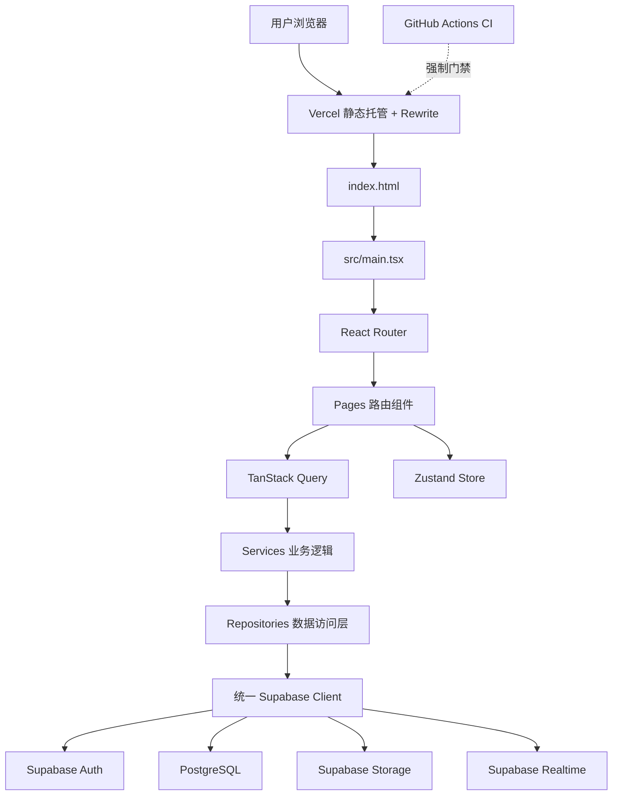
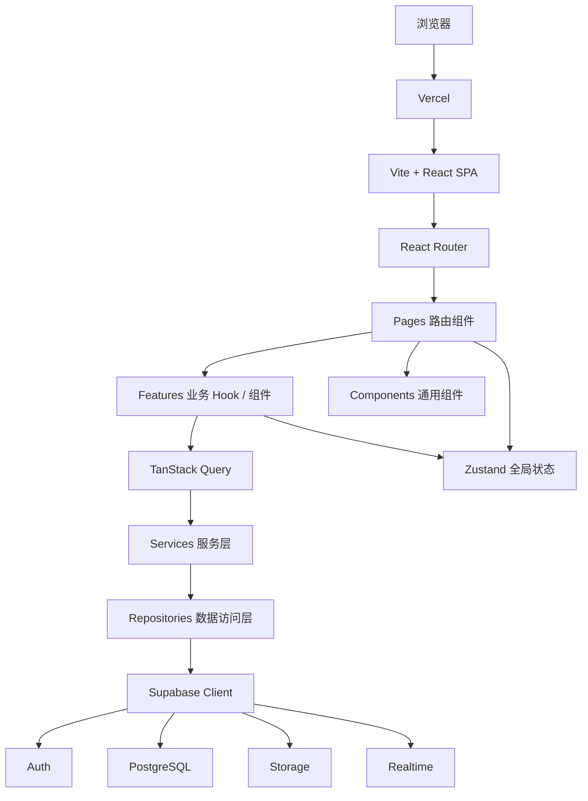
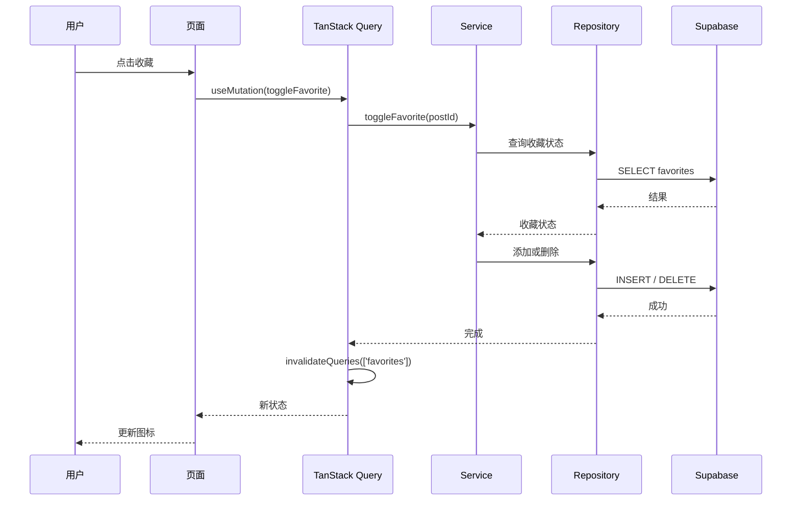
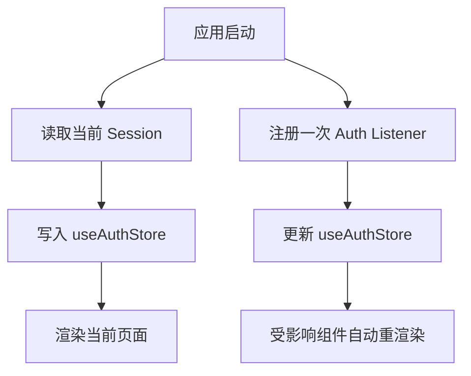
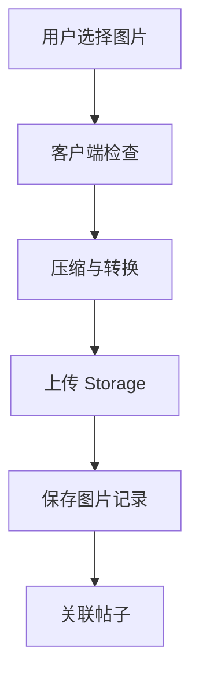
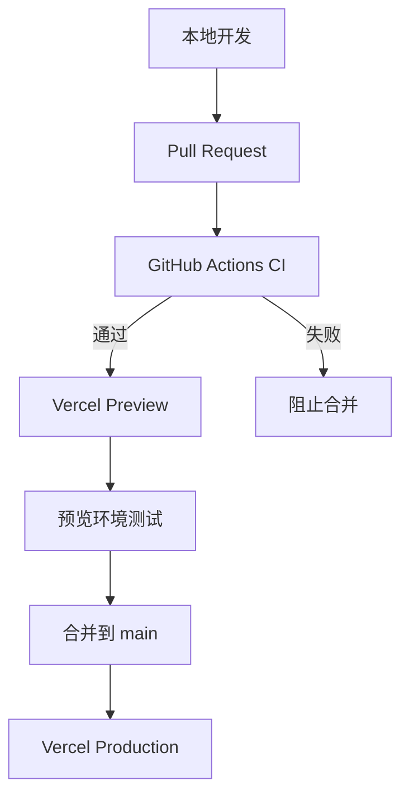

# Saminest 系统架构设计

- 文档版本：2.0
- 产品版本：MVP / V1（重写版）
- 更新时间：2026-07
- 适用项目：Saminest
- 当前技术栈：Vite、TypeScript、React、React Router、TanStack Query、Zustand、Supabase、Vercel
- 文档状态：生效
- 关联决策：ADR-002（详见第 30 节）

---

## 0. 本次版本变更说明

本版本是对 v1.0 的整体重写，而非增量修订。核心变化：

| 领域 | v1.0 | v2.0 | 原因 |
|---|---|---|---|
| UI 层实现 | Vanilla TypeScript + DOM 字符串模板 | React | 交互复杂度上升后手写 DOM 维护成本过高 |
| 路由 | Hash Router | React Router（History 模式） | 解决 SEO 与分享预览问题 |
| 状态管理 | 未规定具体实现 | Zustand（全局）+ React 本地状态 | 消除“各写各的”风险 |
| 数据请求 | 手写 fetch + 手写缓存 | TanStack Query | 统一加载态、缓存失效、去重请求 |
| CI | 依赖人工执行检查清单 | GitHub Actions 强制执行 | 防止赶进度时跳过验证 |
| 数据库 | 沿用旧 Schema | 重新设计（迁移文件从零开始） | 旧 Schema 存在设计问题，重写成本低于修补成本 |
| 视觉 | — | 保留（颜色/字体/间距提取为设计 Token） | DOM 结构和交互方式不再受旧实现约束 |
| i18n | 未提及 | 预留结构，不实现 | 当前面向华语社区，暂不需要，但不应堵死未来扩展 |

以下章节保留 v1.0 中与技术栈无关的治理原则（分层规则、禁止清单、扩展模型、安全模型），并将技术相关章节替换为新技术栈的对应写法。

---

## 1. 文档目的

本文档用于定义 Saminest 的系统架构、模块边界、代码依赖规则、数据访问方式和长期演进方向。

本文档主要解决以下问题：

1. 当前系统由哪些部分组成。
2. 页面、业务逻辑和数据库代码应分别放在哪里。
3. 新功能应如何接入现有项目。
4. 如何保证质量门禁不依赖人工自觉执行。
5. 如何避免项目随着功能增加变成难以维护的单体代码。
6. 如何为未来扩展招聘、服务、活动、商家等分类保留能力。
7. 什么时候需要升级后端架构，而不是过早重构。

---

## 2. 架构目标

Saminest 当前是一个由独立开发者维护的早期产品。

因此，当前架构应优先满足：

- 简单
- 稳定
- 容易理解
- 容易测试
- 容易部署
- 不过度设计
- 支持未来扩展
- **质量门禁可自动执行，不依赖开发者记得手动跑检查**

当前阶段不追求一次性设计成大型互联网平台，而是建立清晰边界，使系统能够持续演进。

---

## 3. 产品范围

Saminest 当前面向 DMV 华语社区，核心业务包括：

- 租房
- 求租
- 二手
- 用户认证
- 信息发布
- 图片上传
- 收藏
- 站内消息
- 举报
- 内容审核

现有页面入口包括：

- 首页
- 分类
- 发布
- 消息
- 我的

桌面端还提供：

- 首页
- 租房
- 求租
- 二手

当前网站使用 React Router（History 模式），不再使用 Hash 路由。

---

## 4. 当前系统架构



系统不再存在“新旧代码并存”的迁移阶段，本版本是全新实现，无 legacy 包袱。

---

## 5. 目标架构



长期边界保持不变：

```text
页面展示
    ↓
业务模块
    ↓
业务服务
    ↓
数据访问
    ↓
Supabase / 后端 API
```

页面不应直接执行复杂数据库查询。数据库访问细节不应散落在组件事件处理代码中。

---

## 6. 技术选型

### 6.1 Vite

选择原因不变：启动速度快、配置简单、支持 TypeScript、构建结果适合静态部署、适合独立开发阶段。

### 6.2 TypeScript

规则：

- 所有代码使用 TypeScript，不使用隐式 `any`。
- 从 Supabase 返回的数据应有明确类型，类型由 Supabase CLI 从 Schema 自动生成（见 6.7）。

### 6.3 React（替代 Vanilla TypeScript）

**风险修复 1：不再使用手写 DOM 字符串模板。**

选择原因：

- 收藏、消息、发布、审核等功能交互复杂度高，手写 DOM 更新和事件委托的维护成本已验证过高（v1.0 项目的实际教训）。
- React 生态成熟，组件库、表单方案、图片上传方案选择多，AI 辅助开发（含 Claude Code）对 React 的支持深度更高，适合独立开发者提高产出效率。
- 声明式渲染减少手动同步 DOM 和状态的心智负担。

规则：

- 函数组件 + Hooks，不使用 Class 组件。
- 组件必须是纯函数：相同 props 渲染相同结果，副作用放入 `useEffect` 并明确依赖数组。
- 不在组件内部直接调用 Supabase SDK。

### 6.4 React Router（替代 Hash Router）

**风险修复 2：History 模式替代 Hash 路由，解决 SEO 与分享问题。**

选择原因：

- Hash 路由（`#/post/123`）搜索引擎抓取和索引支持差，社交平台（微信、小红书）分享时无法正确生成预览卡片，这对依赖“被搜到、被分享”驱动增长的社区平台是直接的获客损失。
- History 模式生成正常 URL（`/post/123`），配合 Vercel 的 rewrite 规则解决刷新 404 问题，不需要上升到 SSR 复杂度。
- 暂不引入 Next.js：避免过早承担其约定和部署复杂度，等内容规模真正触发 SEO 瓶颈（见第 19 节）时再评估。

Vercel 配置要求（`vercel.json`）：

```json
{
  "rewrites": [
    { "source": "/((?!api/).*)", "destination": "/index.html" }
  ]
}
```

### 6.5 状态管理：Zustand + React 本地状态

**风险修复 4：明确规定跨页面共享状态的具体实现方式。**

v1.0 只描述了“哪些数据应该放全局状态”，但没有规定用什么模式实现，导致长期容易出现“各功能各写一套”的风险。v2.0 明确规定：

| 状态类型 | 实现方式 | 示例 |
|---|---|---|
| 跨页面共享的客户端状态 | Zustand store | 当前用户、Session、未读消息数、临时筛选条件 |
| 服务器数据（来自 Supabase） | TanStack Query（见 6.6），不放入 Zustand | 帖子列表、帖子详情、收藏状态 |
| 单个页面/组件内部状态 | `useState` / `useReducer` | 表单输入、弹窗开关、本地 UI 状态 |

规则：

- 服务器数据一律不复制进 Zustand，避免出现“Query 缓存”和“全局状态”两份不同步的数据源。
- 每个 Zustand store 职责单一（如 `useAuthStore`、`useUIStore`），不建立单一巨型 store。
- Store 内不直接调用 Supabase SDK，只存放数据和纯同步操作。

### 6.6 TanStack Query（新增，替代手写请求/缓存逻辑）

**风险修复 5：Repository 层缺少缓存策略的问题，通过引入统一的数据请求库解决。**

v1.0 要求“避免重复查询”“统一处理加载状态”，但依赖手写实现，容易在功能增多后出现不一致或遗漏。

规则：

- 所有对 Repository 的调用通过 `useQuery` / `useMutation` 包装，不在组件内直接 `await` Repository 方法。
- 每个查询必须有明确的 `queryKey`，命名规则：`[资源名, 参数]`，例如 `['posts', { category: 'rent', page: 1 }]`。
- 写操作（`useMutation`）成功后必须显式 `invalidateQueries`，不依赖手动刷新页面数据。
- 默认 `staleTime` 按数据类型分级：

```text
分类配置、地区配置：staleTime 较长（不常变化）
帖子列表：staleTime 短（需要较新数据）
用户 Session：交由 Zustand + Supabase Auth 监听器管理，不放入 Query
```

- Query 相关代码放在 `features/*/queries.ts`，不散落在页面组件里。

### 6.7 Supabase

Supabase 承担：用户认证、PostgreSQL 数据库、Row Level Security、图片文件存储、Realtime，必要时使用 Edge Functions。

新增规则：

- 数据库类型通过 `supabase gen types typescript` 自动生成，禁止手写与 Schema 不同步的类型。
- 必须通过统一数据访问层使用 Supabase，避免所有组件直接调用 SDK。

### 6.8 Vercel

负责静态前端部署、预览部署、正式环境发布、HTTPS、CDN 分发、URL Rewrite（配合 React Router History 模式）。

所有数据安全规则必须由 Supabase Auth、RLS、Storage Policy 或受信任的服务端函数保证，Vercel 不负责核心数据库权限。

---

## 7. 推荐项目目录

```text
saminest/
├── .github/
│   └── workflows/
│       └── ci.yml                 # 见第 23 节
│
├── docs/
│   ├── README.md
│   ├── 01_Product/PRD.md
│   ├── 02_SystemDesign/
│   │   ├── Architecture.md        # 本文档
│   │   └── decisions/             # ADR
│   ├── 03_Database/Tables.md
│   └── 04_Development/AI-Development.md
│
├── public/
│   ├── robots.txt
│   ├── sitemap.xml
│   └── static-assets/
│
├── src/
│   ├── main.tsx
│   ├── App.tsx
│   ├── app/                       # 应用级初始化
│   ├── router/                    # React Router 配置
│   ├── pages/                     # 路由组件
│   ├── features/                  # 业务模块（含 queries.ts）
│   ├── components/                # 通用 UI 组件
│   ├── services/                  # 业务服务层
│   ├── repositories/              # 数据访问层
│   ├── integrations/supabase/     # Supabase Client 封装
│   ├── store/                     # Zustand stores
│   ├── types/
│   │   └── database.generated.ts  # Supabase 自动生成类型
│   ├── i18n/                      # 预留，见第 20 节
│   ├── utils/
│   └── styles/
│       └── tokens.css             # 设计 Token，见第 10 节
│
├── tests/
├── supabase/
│   ├── migrations/
│   ├── functions/
│   └── seed.sql
│
├── index.html
├── package.json
├── tsconfig.json
├── vite.config.ts
├── vercel.json
└── README.md
```

目录应在对应模块开发时逐步建立，不要求一次创建所有目录。

---

## 8. 模块职责

### 8.1 `src/main.tsx`

只负责应用启动：挂载 React 根节点、注册 Provider（QueryClientProvider、Router）。

```tsx
import { createRoot } from 'react-dom/client';
import { App } from './App';

createRoot(document.getElementById('root')!).render(<App />);
```

禁止：直接写页面 UI、直接查询数据、堆积业务常量。

### 8.2 `app/`

负责应用级初始化：QueryClient 配置、全局错误边界、Supabase 初始化、Auth 监听启动。

### 8.3 `router/`

负责路由定义、参数读取、登录权限守卫、404 处理。路由层不负责数据查询、上传图片、执行业务规则。

推荐路由（History 模式，无 `#`）：

```text
/
/category/rent
/category/wanted
/category/used
/post/:id
/publish
/messages
/me
/login
/register
/forgot-password
/reset-password
```

守卫示例：

```tsx
function RequireAuth({ children }: { children: React.ReactNode }) {
  const session = useAuthStore((s) => s.session);
  if (!session) return <Navigate to="/login" replace />;
  return children;
}
```

### 8.4 `pages/`

页面（路由组件）负责组合 Feature 和 Component，读取路由参数，控制页面级加载状态。不直接拼写 Supabase 查询，不创建新的 Supabase Client。

### 8.5 `features/`

按用户能力划分的业务模块：

```text
features/posts/
├── queries.ts        # useQuery / useMutation 封装
├── post-service.ts   # 业务逻辑
├── post-validation.ts
├── components/        # 该 feature 专属组件
└── index.ts
```

### 8.6 `components/`

可复用 UI 组件（按钮、输入框、帖子卡片、弹窗、加载态、Toast 等）。组件通过 props 接收数据，通过回调暴露操作，不直接操作数据库，不复制业务规则。

### 8.7 `services/`

业务用例层：`publishPost()`、`toggleFavorite()`、`submitReport()` 等。可调用一个或多个 Repository、执行业务验证、统一处理业务错误。不渲染 UI，不依赖具体 DOM 元素。

### 8.8 `repositories/`

数据访问边界，封装 Supabase 查询，返回明确类型：

```ts
export interface PostRepository {
  getApprovedPosts(input: GetPostsInput): Promise<Post[]>;
  getPostById(id: string): Promise<Post | null>;
  createPost(input: CreatePostInput): Promise<Post>;
  updatePost(id: string, input: UpdatePostInput): Promise<Post>;
}
```

页面和组件不应知道 `.from()` / `.select()` / `.insert()` 等 Supabase 查询细节。

### 8.9 `integrations/supabase/`

全局只创建一个 Supabase Client，Auth listener 只注册一次。

```ts
export function getSupabaseClient(): SupabaseClient;
```

禁止在多个业务文件中调用 `createClient()`。

### 8.10 `store/`（Zustand，替代 v1.0 未定义的 `state/`）

规则见 6.5。示例：

```ts
export const useAuthStore = create<AuthState>((set) => ({
  session: null,
  setSession: (session) => set({ session }),
}));
```

### 8.11 `types/`

跨模块复用类型。数据库类型由 Supabase CLI 自动生成（`database.generated.ts`），业务类型手写并与数据库类型分离，不应让数据库字段结构完全控制页面模型。

### 8.12 `utils/`

只放纯工具函数：日期格式化、金额格式化、字符串处理、URL 处理、基础验证。不适合放业务逻辑或数据库调用。

---

## 9. 依赖方向

```text
Pages
  ↓
Features / Components
  ↓
Services（含 TanStack Query 封装）
  ↓
Repositories
  ↓
Integrations
```

所有模块可依赖 `Types` / `Utils`。禁止反向依赖（如 Repositories → Pages、Services → DOM、Components → Database）。禁止循环依赖。

---

## 10. UI 与设计 Token

**风险修复相关：保留视觉样式，不保留旧 DOM 结构。**

从 v1.0 的 `styles.css` 中提炼出的颜色、字体、间距等视觉规范，独立存放为设计 Token，不迁移原 CSS 选择器（因为 DOM 结构已重新设计）。

```css
/* src/styles/tokens.css */
:root {
  --color-primary: ...;      /* 深蓝 */
  --color-accent: ...;       /* 金色 */
  --font-size-base: ...;
  --spacing-unit: ...;
  --radius-base: ...;
}
```

组件样式基于 Token 构建，不硬编码颜色和间距数值。

推荐采用 Tailwind CSS 并将 Token 接入 `tailwind.config.ts` 的 `theme.extend`，减少手写 CSS 文件的维护量（可选，若团队更熟悉纯 CSS Modules 也可，但必须统一，不混用）。

---

## 11. 路由架构

见第 8.3 节。核心变化：History 模式替代 Hash 路由，其余原则（登录保护、404 处理、参数读取、路由层不含业务逻辑）保持不变。

---

## 12. 数据访问架构



数据访问规则：

1. 页面不直接决定表级权限。
2. 所有敏感操作必须由 RLS 或服务端验证。
3. Repository 返回业务可理解的错误。
4. 查询必须只获取需要的字段。
5. 列表必须支持分页（游标分页优先）。
6. 避免无条件获取全部帖子。
7. 缓存与去重交由 TanStack Query 统一处理，不手写请求缓存。
8. 写操作通过 `useMutation` 的 `isPending` 状态防止重复提交。

---

## 13. 认证架构



必须保证：

- Supabase Client 只有一个，Auth listener 只有一个。
- 登录状态由 `useAuthStore` 统一保存。
- Session 恢复完成前显示加载状态。
- 不能仅依靠前端隐藏按钮实现权限控制。

认证功能：注册、邮箱验证、登录、登出、忘记密码、重置密码、Session 恢复、登录过期处理。

---

## 14. 权限架构

### 14.1 前端体验控制

隐藏无权限按钮、跳转登录页面、显示提示、防止明显错误操作。前端权限不是安全边界。

### 14.2 数据库和服务端权限

由 Supabase RLS、Storage Policy、Edge Function 鉴权、数据所有权验证保证。

角色：`guest` / `user` / `admin`（MVP 阶段），未来新增角色不得依赖硬编码邮箱。

---

## 15. 图片上传架构



客户端检查：文件类型、大小、数量、尺寸、空文件、重复文件。

Storage 规则：用户只能上传到自己的路径；文件名使用生成的唯一 ID，不使用原始文件名；帖子删除后图片延迟清理；上传失败时清理临时文件。

推荐路径：

```text
post-images/{user_id}/{post_id}/{image_id}.webp
```

---

## 16. 错误处理

### 16.1 用户错误

表单未填写、邮箱格式错误、图片过大、未登录、内容不符合规则。处理方式：显示明确中文提示，保留已填写内容，指出具体字段。

### 16.2 网络错误

请求超时、无网络、Supabase 暂时不可用。TanStack Query 的 `retry` 和 `onError` 统一处理，显示重试按钮，不清空表单。

### 16.3 系统错误

数据结构不符合预期、未处理异常、路由初始化失败。捕获异常，显示通用错误状态，记录错误上下文，不向用户展示密钥、SQL 或堆栈。

```ts
export class AppError extends Error {
  constructor(
    message: string,
    public readonly code: string,
    public readonly cause?: unknown,
  ) {
    super(message);
  }
}
```

配合 React Error Boundary 捕获组件树内未处理异常。

---

## 17. 加载状态

TanStack Query 原生提供 `isPending` / `isError` / `isSuccess` / `isFetching` 状态，页面组件基于这些状态渲染：初始加载、加载成功、空数据、部分失败、完全失败、重试、提交中、提交完成。

禁止：页面长时间空白、提交后无反应、请求进行中允许重复点击、失败后清空全部用户输入。

---

## 18. 缓存策略

由 TanStack Query 统一管理，规则见 6.6。分类配置、地区配置等低频变化数据设置较长 `staleTime`；用户权限、审核状态、消息未读数等不进行长期缓存。缓存失效必须显式触发（`invalidateQueries`），不得因缓存导致用户看到无权访问的数据。

---

## 19. SEO 架构

采用 React Router History 模式后（见 6.4），基础 SEO 问题已部分缓解（可索引 URL、正常分享预览）。仍需处理：

- 页面标题、Meta Description、Canonical URL、Open Graph（可用 `react-helmet-async` 或类似库按页面动态设置）。
- Sitemap、robots.txt。
- 帖子详情、分类页可索引性。

随着帖子内容增长，应评估：预渲染静态分类页、为公开帖子生成可抓取页面、结构化数据、迁移支持 SSR/SSG 的框架（如 Next.js）。在内容规模较小前，不立即进行 SSR 重构。

---

## 20. 国际化（i18n）预留

**风险修复 6：当前不实现，但预留结构，避免未来扩展受阻。**

当前阶段：

- 界面文案直接使用中文硬编码，不引入 i18n 库，不产生当前不需要的复杂度。
- 但所有面向用户的文案统一放在组件顶层或 `features/*/copy.ts` 中，不与业务逻辑或样式混写。

预留规则（现在遵守，成本极低；未来若需要扩展会大幅降低改造成本）：

- 不在 JSX 中拼接包含业务逻辑的中文字符串（如 `"还剩" + count + "天过期"`），改为封装成独立函数，便于未来替换为 `t()` 调用。
- 日期、金额格式化统一走 `utils/format.ts`，不在组件内直接拼字符串，为未来接入 `Intl` API 预留空间。
- 不需要现在建立 `i18n/` 目录下的翻译文件，只需保证文案不与逻辑耦合。

触发正式引入 i18n（如 `react-i18next`）的条件：明确要拓展非华语用户群体，或多语言需求成为真实产品需求。

---

## 21. 性能要求

MVP 性能目标：

- 首屏尽快展示基础结构，路由组件按页面 `React.lazy` 懒加载。
- 首页不一次加载全部帖子，列表分页/游标加载。
- 图片懒加载，上传前压缩。
- 避免重复初始化 Supabase Client、重复 Auth listener。
- 生产构建必须通过。

建议指标：LCP < 2.5s，CLS < 0.1，INP < 200ms。作为产品目标，不作为早期每次发布的绝对阻塞条件，但出现明显回退时必须处理。

---

## 22. 安全架构

最低安全要求不变：

- 所有业务表启用 RLS，用户只能修改自己的内容，普通用户不能设置审核状态。
- 管理员权限不得只在前端判断，Service Role Key 不得出现在浏览器代码。
- 环境变量不得提交到 Git，Storage 必须配置访问策略。
- 用户输入输出前正确转义（React 默认转义 JSX 文本，但注意 `dangerouslySetInnerHTML` 的使用需额外审查）。
- 重要操作限制频率，删除采用软删除策略，敏感操作记录审计日志。

禁止在前端保存：Service Role Key、管理员数据库密码、用户密码、私密 API 密钥。

---

## 23. CI 与质量门禁（新增章节）

**风险修复 3：验证清单从“人工执行”升级为“CI 强制执行”。**

v1.0 依赖开发者在每次修改后手动运行 `typecheck` / `test` / `build` / `git diff --check`，在赶进度时容易被跳过。v2.0 通过 GitHub Actions 强制执行，未通过不允许合并。

```yaml
# .github/workflows/ci.yml
name: CI
on:
  pull_request:
    branches: [main]
  push:
    branches: [main]

jobs:
  verify:
    runs-on: ubuntu-latest
    steps:
      - uses: actions/checkout@v4
      - uses: actions/setup-node@v4
        with:
          node-version: 20
      - run: npm ci
      - run: npm run typecheck
      - run: npm run test
      - run: npm run build
      - run: git diff --check
```

规则：

- `main` 分支设置分支保护规则，要求 CI 通过才能合并（即使是独立开发者自己也通过 PR 流程走一遍，避免绕过检查直接 push）。
- 本地开发仍可运行相同命令做快速反馈，但 CI 结果是唯一权威判断，不得凭本地“跑过一次”就声称验证通过。
- 若某条命令在项目中不存在，必须先在 `package.json` 中补全，不得虚假报告已通过。

---

## 24. 测试架构

### 24.1 单元测试

格式化函数、验证函数、路由参数解析、数据转换、Zustand store 的纯逻辑部分。

### 24.2 集成测试

Auth 状态恢复、发布流程、收藏流程、Repository 查询、上传流程、TanStack Query 的 `queryFn` / `mutationFn`。

### 24.3 组件测试

关键交互组件（发布表单、图片上传、收藏按钮）使用 React Testing Library，测试用户可见行为而非实现细节。

### 24.4 RLS 测试

用户不能修改他人帖子；普通用户不能审核帖子；用户不能读取不允许的数据；用户只能删除自己的收藏；被封禁用户受到限制。

### 24.5 构建验证

由 CI 强制执行（见第 23 节），不再依赖人工记忆执行。

---

## 25. 部署架构



环境：`local` / `preview` / `production`，各自独立配置。生产数据库变更必须通过迁移执行，禁止直接在生产数据库随意修改表结构后不记录 SQL。

---

## 26. 数据库设计与迁移规则

数据库为本次重写的一部分，从零设计。规则：

1. 所有结构变化必须有迁移文件（`supabase/migrations/`），命名 `YYYYMMDDHHMMSS_description.sql`。
2. 迁移文件可重复审查，记录目的，包含回滚或修复方案。
3. 同步更新 `docs/03_Database/Tables.md`。
4. 每个业务表设计后立即编写对应 RLS 测试，不延后。
5. 类型通过 `supabase gen types typescript` 自动生成，不手写数据库类型。
6. 设计新 Schema 时参考 v1.0 实际暴露的问题（字段冗余、缺少索引、状态字段定义不清晰等），避免重复同样的坑，具体表结构在单独的数据库设计文档中评审。

---

## 27. 功能扩展方式

未来增加招聘、服务、活动等功能时，优先采用可扩展分类模型，而不是复制整个系统。

帖子共享基础字段：

```text
id
author_id
category_id
title
description
status
location
created_at
updated_at
```

分类特有字段采用独立详情表（`rental_details`、`job_details`、`service_details`、`vehicle_details` 等）或分类配置表，不把所有未来字段提前塞进 `posts` 表。共享发布流程、审核流程、收藏、举报、搜索基础能力、图片系统。

---

## 28. 什么时候需要独立后端

当前不需要立即创建独立后端。出现以下情况时应重新评估：复杂支付流程、多步骤交易、大量第三方服务集成、复杂审核和风控、大规模搜索排序、私密服务端凭证调用、长时间后台任务、大量异步队列、Supabase RLS 无法清晰表达业务规则、数据量或成本出现明显瓶颈、多客户端需要统一业务 API、合规要求需要更强隔离。

迁移方向：`Browser → Backend API → PostgreSQL / Storage / Search / Queue`。在达到实际需求前不提前维护独立后端。

---

## 29. 未来架构演进

### 阶段一：当前 MVP（重写版）

```text
Vite + React + TypeScript
React Router (History)
TanStack Query + Zustand
Supabase
Vercel + GitHub Actions CI
```

### 阶段二：产品验证

完善 RLS、自动化测试覆盖率提升、错误监控（如 Sentry）、数据埋点。

### 阶段三：DMV 规模增长

更完善的搜索、内容审核工具、反垃圾、分页和缓存优化、预览环境、数据库监控。

### 阶段四：多城市扩展

城市与地区配置化、搜索服务、异步任务、管理员权限体系、运营后台、评估 SSR/SSG（如迁移 Next.js）。

### 阶段五：综合分类平台

独立后端 API、队列、搜索引擎、推荐系统、广告系统、支付系统、移动端应用、可观测性平台、正式引入 i18n（若需要）。

架构升级必须由实际瓶颈驱动。

---

## 30. 架构决策记录（ADR）

目录：`docs/02_SystemDesign/decisions/`

### ADR-002：采用 React 全量重写，替代 Vanilla TypeScript + Hash Router

**状态**：Accepted

**背景**：v1.0 采用 Vanilla TypeScript + DOM 字符串模板 + Hash Router，在收藏、消息、发布等强交互功能开发中暴露维护成本过高的问题；同时 Hash Router 存在 SEO 和分享预览缺陷；数据库 Schema 存在早期设计问题，修补成本高于重新设计成本。

**决策**：前端全量迁移到 React + React Router（History 模式）+ TanStack Query + Zustand；数据库重新设计；视觉设计（颜色/字体/间距）保留并提炼为设计 Token，DOM 结构和交互方式不受旧实现约束；分层原则（Pages/Features/Services/Repositories）、扩展模型、RLS 安全模型、反过度设计清单保留。

**原因**：这些问题的触发条件已经出现或即将出现，提前解决的成本低于继续积累技术债后再解决的成本。独立开发者精力有限，一次性解决比反复评估是否要迁移更省心力。

**影响**：所有新代码使用 React 编写；不再维护 `legacy-app.js`；补充 CI 门禁（见 ADR-003）。

### ADR-003：引入 CI 强制验证门禁

**状态**：Accepted

**背景**：v1.0 依赖开发者人工执行 `typecheck` / `test` / `build` 等验证命令，赶进度时容易遗漏。

**决策**：通过 GitHub Actions 在每次 PR 和合并前强制执行完整验证流程，`main` 分支开启保护规则。

**原因**：独立开发者是唯一的质量把关人，容错空间小，自动化门禁比自觉执行更可靠。

**影响**：所有改动通过 PR 流程合并，即使是开发者本人也不直接 push 到 `main`。

需要记录的其他重大决策：是否引入独立后端、是否更换数据库、是否使用搜索引擎、是否采用 SSR、是否正式引入 i18n。

---

## 31. 明确禁止的做法

1. 在多个文件创建 Supabase Client。
2. 组件直接写大量数据库查询，绕过 Repository。
3. 在 `main.tsx` 堆积业务代码。
4. 使用全局可变变量（非 Zustand）存储业务数据。
5. 重复注册 Auth listener 或全局事件监听器。
6. 依靠前端角色判断保护敏感数据。
7. 在代码中硬编码管理员邮箱。
8. 将 Service Role Key 放到前端。
9. 无测试直接大规模重构。
10. 修改数据库却不保存迁移文件。
11. 复制粘贴整个页面来开发新分类。
12. 因未来可能需要而提前引入复杂基础设施（含过早引入 i18n 库）。
13. 未经 CI 验证声称测试或构建已通过。
14. 在没有 ADR 记录的情况下改变核心架构。
15. 服务器数据同时存在于 TanStack Query 缓存和 Zustand store 两处，导致状态不同步。
16. 在 JSX 中直接拼接包含业务逻辑的中文字符串（违反第 20 节 i18n 预留规则）。

---

## 32. 新功能开发检查清单

开发新功能前：

- [ ] PRD 是否定义了需求？优先级是否明确？
- [ ] 是否影响数据库？是否影响 RLS？
- [ ] 是否需要新的路由？
- [ ] 是否可以复用现有组件？
- [ ] 是否应该创建新的 Feature？
- [ ] 数据请求是否规划了 `queryKey` 和缓存策略？
- [ ] 文案是否与逻辑解耦（i18n 预留）？

开发完成后（由 CI 自动验证的部分标注 *CI*）：

- [ ] TypeScript 检查通过 *CI*
- [ ] 测试通过 *CI*
- [ ] 构建通过 *CI*
- [ ] `git diff --check` 通过 *CI*
- [ ] 没有增加重复 Client / 重复 listener
- [ ] 没有泄露密钥
- [ ] 服务器数据未被复制进 Zustand
- [ ] 移动端核心流程已人工测试
- [ ] 文档已更新
- [ ] 数据库变更已写迁移文件并更新 `Tables.md`

---

## 33. 当前阶段架构结论

Saminest 当前采用：

```text
Vite + React + TypeScript
React Router (History)
TanStack Query + Zustand
Supabase
Vercel + GitHub Actions CI
```

当前最重要的工作：

1. 保持单一 Supabase Client、单一 Auth listener。
2. 分层职责清晰：Pages → Features → Services → Repositories。
3. 服务器数据统一交给 TanStack Query，不手写缓存。
4. 跨页面状态统一放 Zustand，职责单一。
5. 质量门禁交给 CI，不依赖人工自觉。
6. 数据库变更全部走迁移文件，同步更新文档。
7. 只在真实瓶颈出现后升级架构（独立后端、SSR、i18n 等）。

---

## 34. 文档维护规则

出现以下变化时必须更新本文档：技术栈变化、路由方式变化、Supabase 集成方式变化、新增独立后端、数据访问层变化、状态管理方式变化、部署方式变化、目录结构重大变化、权限模型变化、CI 流程变化。

文档修改应尽量与相关代码放在同一个 Git 提交中，提交信息建议：

```text
docs: update application architecture
```

或：

```text
refactor: migrate favorites module and update architecture
```

未来功能采用模块化扩展，原则不变：不修改已有核心数据结构；优先新增独立业务模块；复用用户、图片、消息、收藏、举报等公共能力；不影响现有租房、求租、二手业务。