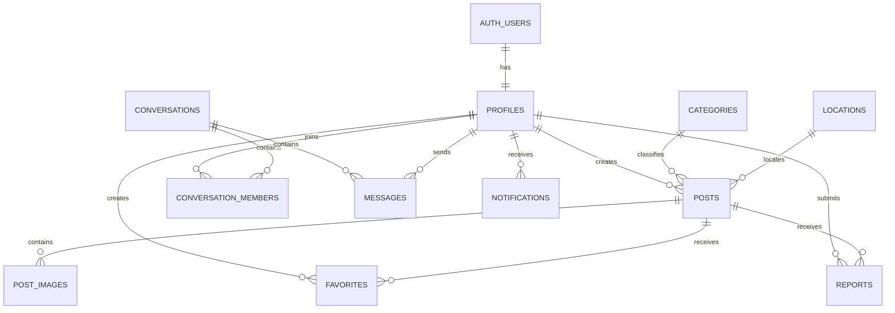

# Saminest 数据库设计

- 文档版本：1.0
- 产品阶段：MVP / V1
- 更新时间：2026-07
- 数据库：Supabase PostgreSQL
- 文档状态：生效
- 当前范围：租房、求租、二手、收藏、举报、消息、通知和内容审核

---

## 1. 文档目的

本文档用于定义 Saminest 当前阶段的数据库结构、字段规范、表之间的关系、索引原则和数据生命周期。

当前只设计已经确定需要开发的功能：

- 用户资料
- 租房
- 求租
- 二手
- 帖子图片
- 收藏
- 举报
- 站内消息
- 通知
- 内容审核

论坛、找搭子、招聘、商家、活动、汽车等未来功能暂不设计具体数据表。

未来新增业务时，应采用独立模块扩展，尽量复用现有的用户、图片、消息、举报和通知能力，不应为了不确定的功能提前增加大量字段和表。

---

## 2. 数据库设计原则

Saminest 数据库遵循以下原则：

1. 只设计已经确定的业务。
2. 不为不确定的未来功能提前建表。
3. 重要关系使用外键。
4. 用户权限由 RLS 控制。
5. 生产数据库结构变化必须通过迁移文件完成。
6. 数据表使用统一命名规则。
7. 重要业务数据优先软删除。
8. 页面不能代替数据库权限。
9. 不把所有业务字段都塞进一张表。
10. 新模块优先新增独立表，不破坏现有数据结构。

本文档描述的是目标结构。

如果当前 Supabase 中已经存在不同结构，应先审计现有表和代码，再通过迁移逐步调整。禁止直接删除生产表或生产数据。

---

## 3. 命名规范

### 3.1 表名

表名使用：

```text
小写
复数
snake_case
```

正确示例：

```text
profiles
posts
post_images
favorites
reports
conversations
conversation_members
messages
notifications
```

错误示例：

```text
User
PostTable
postImage
tbl_posts
```

### 3.2 字段名

字段名使用：

```text
小写
snake_case
```

正确示例：

```text
user_id
display_name
created_at
updated_at
published_at
```

### 3.3 主键

除 `profiles` 外，默认使用 UUID：

```sql
id uuid primary key default gen_random_uuid()
```

`profiles.id` 与 Supabase Auth 用户 ID 保持一致：

```sql
id uuid primary key references auth.users(id)
```

### 3.4 时间字段

主要业务表通常包含：

```text
created_at
updated_at
```

推荐类型：

```sql
timestamptz
```

推荐默认值：

```sql
now()
```

需要软删除的表增加：

```text
deleted_at
```

### 3.5 布尔字段

布尔字段使用清晰前缀：

```text
is_verified
is_active
is_read
is_blocked
```

### 3.6 状态字段

状态字段使用小写英文值。

例如：

```text
draft
pending
approved
rejected
archived
deleted
```

状态值应通过数据库约束、枚举类型或应用层类型控制，避免出现拼写不同但含义相同的值。

---

## 4. 核心实体关系



---

## 5. 数据表总览

当前建议的数据表：

```text
profiles
categories
locations
posts
post_images
favorites
reports
conversations
conversation_members
messages
notifications
moderation_actions
```

其中：

- `profiles`：用户公开资料和账号业务状态
- `categories`：帖子分类
- `locations`：城市和地区
- `posts`：租房、求租和二手帖子
- `post_images`：帖子图片
- `favorites`：收藏关系
- `reports`：举报记录
- `conversations`：会话
- `conversation_members`：会话成员
- `messages`：消息
- `notifications`：系统通知
- `moderation_actions`：管理员审核记录

---

# 6. profiles

## 6.1 作用

保存用户在 Saminest 中的公开资料、账号业务状态和角色。

Supabase Auth 负责：

- 邮箱
- 密码
- Session
- 邮箱验证
- 身份认证

`profiles` 不存储用户密码。

## 6.2 字段

| 字段 | 类型 | 是否为空 | 默认值 | 说明 |
|---|---|---:|---|---|
| `id` | `uuid` | 否 | 无 | 主键，与 `auth.users.id` 一致 |
| `display_name` | `text` | 否 | 无 | 显示名称 |
| `avatar_url` | `text` | 是 | `null` | 头像地址 |
| `bio` | `text` | 是 | `null` | 个人简介 |
| `location_id` | `uuid` | 是 | `null` | 用户常用地区 |
| `role` | `text` | 否 | `user` | 用户角色 |
| `account_status` | `text` | 否 | `active` | 账号状态 |
| `is_verified` | `boolean` | 否 | `false` | 是否完成平台认证 |
| `last_active_at` | `timestamptz` | 是 | `null` | 最近活跃时间 |
| `created_at` | `timestamptz` | 否 | `now()` | 创建时间 |
| `updated_at` | `timestamptz` | 否 | `now()` | 更新时间 |
| `deleted_at` | `timestamptz` | 是 | `null` | 软删除时间 |

## 6.3 role 可选值

```text
user
moderator
admin
super_admin
```

MVP 主要使用：

```text
user
admin
```

禁止通过硬编码邮箱判断管理员身份。

## 6.4 account_status 可选值

```text
active
restricted
suspended
deleted
```

说明：

- `active`：正常使用
- `restricted`：限制部分功能
- `suspended`：暂停账号
- `deleted`：用户已注销或账号已删除

## 6.5 索引

建议索引：

```text
profiles(location_id)
profiles(role)
profiles(account_status)
profiles(created_at)
```

## 6.6 权限原则

- 用户可以读取正常公开资料。
- 用户只能修改自己的资料。
- 普通用户不能修改自己的 `role`。
- 普通用户不能修改自己的 `account_status`。
- 管理员角色和账号状态只能由受信任的后台操作修改。

---

# 7. categories

## 7.1 作用

保存帖子分类。

当前分类：

```text
rent
wanted
used
```

未来增加招聘、服务等模块时，可以新增分类，但不代表所有未来模块都必须继续使用 `posts` 表。

## 7.2 字段

| 字段 | 类型 | 是否为空 | 默认值 | 说明 |
|---|---|---:|---|---|
| `id` | `uuid` | 否 | 自动生成 | 主键 |
| `slug` | `text` | 否 | 无 | 程序使用的唯一标识 |
| `name_zh` | `text` | 否 | 无 | 中文名称 |
| `name_en` | `text` | 是 | `null` | 英文名称 |
| `description` | `text` | 是 | `null` | 分类说明 |
| `sort_order` | `integer` | 否 | `0` | 排序 |
| `is_active` | `boolean` | 否 | `true` | 是否启用 |
| `created_at` | `timestamptz` | 否 | `now()` | 创建时间 |
| `updated_at` | `timestamptz` | 否 | `now()` | 更新时间 |

## 7.3 初始数据

```text
rent   租房
wanted 求租
used   二手
```

## 7.4 约束

```text
slug 必须唯一
```

## 7.5 权限原则

- 所有人可以读取启用中的分类。
- 只有管理员可以新增、修改或停用分类。

---

# 8. locations

## 8.1 作用

保存州、城市、区域等可复用地理信息。

不建议在所有帖子中完全依赖用户自由输入地区，否则后续搜索、筛选和多城市扩展会变得困难。

## 8.2 字段

| 字段 | 类型 | 是否为空 | 默认值 | 说明 |
|---|---|---:|---|---|
| `id` | `uuid` | 否 | 自动生成 | 主键 |
| `parent_id` | `uuid` | 是 | `null` | 上级地区 |
| `type` | `text` | 否 | 无 | 地区类型 |
| `name` | `text` | 否 | 无 | 地区名称 |
| `slug` | `text` | 否 | 无 | URL 和程序标识 |
| `state_code` | `text` | 是 | `null` | 州缩写，例如 VA |
| `country_code` | `text` | 否 | `US` | 国家代码 |
| `latitude` | `numeric` | 是 | `null` | 纬度 |
| `longitude` | `numeric` | 是 | `null` | 经度 |
| `sort_order` | `integer` | 否 | `0` | 排序 |
| `is_active` | `boolean` | 否 | `true` | 是否启用 |
| `created_at` | `timestamptz` | 否 | `now()` | 创建时间 |
| `updated_at` | `timestamptz` | 否 | `now()` | 更新时间 |

## 8.3 type 可选值

```text
country
state
metro
city
district
neighborhood
```

## 8.4 约束

建议唯一约束：

```text
unique(parent_id, slug)
```

## 8.5 初始范围

MVP 先维护 DMV 常用地区，例如：

```text
Washington, DC
Arlington
Alexandria
Fairfax
Tysons
Vienna
Reston
Centreville
Manassas
Woodbridge
Rockville
Bethesda
Silver Spring
College Park
```

不需要第一天就录入全美国所有城市。

---

# 9. posts

## 9.1 作用

保存租房、求租和二手帖子中的公共数据。

`posts` 是当前分类信息业务的核心表。

未来如果增加完全不同的业务，例如论坛或找搭子，应优先建立独立模块，而不是强行把所有数据都放进 `posts`。

## 9.2 字段

| 字段 | 类型 | 是否为空 | 默认值 | 说明 |
|---|---|---:|---|---|
| `id` | `uuid` | 否 | 自动生成 | 主键 |
| `author_id` | `uuid` | 否 | 无 | 发布用户 |
| `category_id` | `uuid` | 否 | 无 | 分类 |
| `location_id` | `uuid` | 是 | `null` | 标准地区 |
| `title` | `text` | 否 | 无 | 标题 |
| `description` | `text` | 否 | 无 | 详细描述 |
| `price_amount` | `numeric(12,2)` | 是 | `null` | 价格 |
| `currency_code` | `text` | 否 | `USD` | 货币 |
| `price_label` | `text` | 是 | `null` | 面议、免费等展示文本 |
| `contact_method` | `text` | 是 | `null` | 联系方式类型 |
| `contact_value` | `text` | 是 | `null` | 联系内容 |
| `status` | `text` | 否 | `pending` | 帖子状态 |
| `visibility` | `text` | 否 | `public` | 可见范围 |
| `view_count` | `bigint` | 否 | `0` | 浏览数 |
| `favorite_count` | `bigint` | 否 | `0` | 收藏数 |
| `published_at` | `timestamptz` | 是 | `null` | 发布时间 |
| `expires_at` | `timestamptz` | 是 | `null` | 过期时间 |
| `archived_at` | `timestamptz` | 是 | `null` | 下架时间 |
| `created_at` | `timestamptz` | 否 | `now()` | 创建时间 |
| `updated_at` | `timestamptz` | 否 | `now()` | 更新时间 |
| `deleted_at` | `timestamptz` | 是 | `null` | 软删除时间 |

## 9.3 status 可选值

```text
draft
pending
approved
rejected
archived
deleted
```

说明：

- `draft`：草稿
- `pending`：等待审核
- `approved`：审核通过
- `rejected`：审核拒绝
- `archived`：用户或管理员下架
- `deleted`：软删除

## 9.4 visibility 可选值

```text
public
unlisted
private
```

MVP 主要使用：

```text
public
```

## 9.5 contact_method 可选值

```text
message
email
phone
wechat
other
```

联系信息属于敏感数据，不能默认在所有列表查询中返回。

建议只在满足产品规则时读取。

## 9.6 字段验证

建议：

```text
title 长度：1–120 字符
description 长度：1–10000 字符
price_amount >= 0
currency_code 长度为 3
```

## 9.7 索引

建议索引：

```text
posts(author_id)
posts(category_id)
posts(location_id)
posts(status)
posts(created_at desc)
posts(published_at desc)
posts(category_id, status, published_at desc)
posts(location_id, status, published_at desc)
posts(author_id, status, created_at desc)
```

列表查询通常需要：

```text
status = approved
deleted_at is null
```

可根据实际查询创建部分索引。

## 9.8 权限原则

游客：

- 只能读取 `approved`
- 只能读取 `public`
- 不能读取已软删除帖子

登录用户：

- 可以创建自己的帖子
- 可以读取自己的草稿、待审核和被拒绝帖子
- 只能修改自己的帖子
- 不能把状态直接改为 `approved`
- 不能修改 `view_count`
- 不能修改 `favorite_count`

管理员：

- 可以审核和管理帖子
- 可以修改帖子审核状态
- 可以查看举报关联内容

---

# 10. post_images

## 10.1 作用

保存帖子图片信息。

图片文件本体存放在 Supabase Storage，数据库只保存文件路径和元数据。

## 10.2 字段

| 字段 | 类型 | 是否为空 | 默认值 | 说明 |
|---|---|---:|---|---|
| `id` | `uuid` | 否 | 自动生成 | 主键 |
| `post_id` | `uuid` | 否 | 无 | 所属帖子 |
| `owner_id` | `uuid` | 否 | 无 | 上传用户 |
| `storage_path` | `text` | 否 | 无 | Storage 内部路径 |
| `public_url` | `text` | 是 | `null` | 公开地址，可按策略省略 |
| `alt_text` | `text` | 是 | `null` | 图片替代文本 |
| `width` | `integer` | 是 | `null` | 图片宽度 |
| `height` | `integer` | 是 | `null` | 图片高度 |
| `size_bytes` | `bigint` | 是 | `null` | 文件大小 |
| `mime_type` | `text` | 是 | `null` | 文件类型 |
| `sort_order` | `integer` | 否 | `0` | 图片顺序 |
| `created_at` | `timestamptz` | 否 | `now()` | 创建时间 |
| `deleted_at` | `timestamptz` | 是 | `null` | 软删除时间 |

## 10.3 约束

建议唯一约束：

```text
unique(post_id, sort_order)
unique(storage_path)
```

## 10.4 Storage 路径

推荐：

```text
post-images/{user_id}/{post_id}/{image_id}.webp
```

## 10.5 权限原则

- 所有人可以读取公开已审核帖子的图片。
- 用户只能上传到自己的目录。
- 用户只能管理自己帖子的图片。
- 删除帖子时不应立即无记录删除图片。
- 图片清理可采用延迟任务。

---

# 11. favorites

## 11.1 作用

记录用户收藏帖子。

## 11.2 字段

| 字段 | 类型 | 是否为空 | 默认值 | 说明 |
|---|---|---:|---|---|
| `id` | `uuid` | 否 | 自动生成 | 主键 |
| `user_id` | `uuid` | 否 | 无 | 收藏用户 |
| `post_id` | `uuid` | 否 | 无 | 被收藏帖子 |
| `created_at` | `timestamptz` | 否 | `now()` | 收藏时间 |

## 11.3 约束

必须设置：

```text
unique(user_id, post_id)
```

防止重复收藏。

## 11.4 索引

建议：

```text
favorites(user_id, created_at desc)
favorites(post_id)
```

## 11.5 权限原则

- 用户只能查看自己的收藏。
- 用户只能创建自己的收藏。
- 用户只能删除自己的收藏。
- 用户不能为其他用户创建收藏记录。

## 11.6 收藏数量

`posts.favorite_count` 可以作为冗余统计字段。

该字段不能由普通客户端任意修改。

应通过：

- 数据库函数
- 触发器
- 受信任的服务端逻辑

进行同步。

---

# 12. reports

## 12.1 作用

记录用户举报。

当前主要支持举报帖子。

未来可以扩展举报用户、消息等对象，但不需要现在建立多个举报表。

## 12.2 字段

| 字段 | 类型 | 是否为空 | 默认值 | 说明 |
|---|---|---:|---|---|
| `id` | `uuid` | 否 | 自动生成 | 主键 |
| `reporter_id` | `uuid` | 否 | 无 | 举报人 |
| `target_type` | `text` | 否 | `post` | 举报对象类型 |
| `target_id` | `uuid` | 否 | 无 | 举报对象 ID |
| `reason_code` | `text` | 否 | 无 | 举报原因代码 |
| `description` | `text` | 是 | `null` | 补充说明 |
| `status` | `text` | 否 | `pending` | 处理状态 |
| `reviewer_id` | `uuid` | 是 | `null` | 处理管理员 |
| `resolution_note` | `text` | 是 | `null` | 处理备注 |
| `reviewed_at` | `timestamptz` | 是 | `null` | 处理时间 |
| `created_at` | `timestamptz` | 否 | `now()` | 举报时间 |
| `updated_at` | `timestamptz` | 否 | `now()` | 更新时间 |

## 12.3 target_type 初始值

```text
post
```

未来确有需求时，可以增加：

```text
profile
message
```

## 12.4 reason_code 可选值

```text
scam
spam
duplicate
illegal_content
misleading
harassment
privacy
other
```

## 12.5 status 可选值

```text
pending
reviewing
resolved
dismissed
```

## 12.6 防重复规则

建议限制同一用户短时间内对同一对象重复举报。

可使用唯一约束或服务层规则，例如：

```text
reporter_id + target_type + target_id + active status
```

## 12.7 权限原则

- 登录用户可以创建举报。
- 举报人只能查看自己的举报状态。
- 普通用户不能修改举报处理结果。
- 只有管理员可以处理举报。
- 被举报内容的作者不能读取举报人身份。

---

# 13. conversations

## 13.1 作用

表示站内消息会话。

即使 MVP 消息功能较简单，也建议把会话和消息分开，避免未来聊天记录无法扩展。

## 13.2 字段

| 字段 | 类型 | 是否为空 | 默认值 | 说明 |
|---|---|---:|---|---|
| `id` | `uuid` | 否 | 自动生成 | 主键 |
| `type` | `text` | 否 | `direct` | 会话类型 |
| `post_id` | `uuid` | 是 | `null` | 关联帖子 |
| `created_by` | `uuid` | 否 | 无 | 创建者 |
| `last_message_at` | `timestamptz` | 是 | `null` | 最后消息时间 |
| `created_at` | `timestamptz` | 否 | `now()` | 创建时间 |
| `updated_at` | `timestamptz` | 否 | `now()` | 更新时间 |
| `deleted_at` | `timestamptz` | 是 | `null` | 软删除时间 |

## 13.3 type 初始值

```text
direct
```

未来如果真正需要群聊，再增加：

```text
group
```

## 13.4 约束原则

同一买家、帖子和卖家之间不应无限创建重复会话。

具体去重方式应根据最终消息产品规则确定。

---

# 14. conversation_members

## 14.1 作用

保存会话成员和成员状态。

## 14.2 字段

| 字段 | 类型 | 是否为空 | 默认值 | 说明 |
|---|---|---:|---|---|
| `conversation_id` | `uuid` | 否 | 无 | 会话 |
| `user_id` | `uuid` | 否 | 无 | 用户 |
| `role` | `text` | 否 | `member` | 会话角色 |
| `last_read_at` | `timestamptz` | 是 | `null` | 最后阅读时间 |
| `is_muted` | `boolean` | 否 | `false` | 是否静音 |
| `joined_at` | `timestamptz` | 否 | `now()` | 加入时间 |
| `left_at` | `timestamptz` | 是 | `null` | 离开时间 |

## 14.3 主键

建议使用联合主键：

```text
primary key(conversation_id, user_id)
```

## 14.4 权限原则

- 用户只能读取自己参加的会话。
- 用户只能更新自己的成员状态。
- 普通用户不能把其他用户随意加入私聊。
- 用户离开会话后是否继续保留历史记录，由产品规则决定。

---

# 15. messages

## 15.1 作用

保存站内消息。

MVP 可先支持纯文本消息。

图片、系统消息、撤回等功能以后有明确需求时再扩展。

## 15.2 字段

| 字段 | 类型 | 是否为空 | 默认值 | 说明 |
|---|---|---:|---|---|
| `id` | `uuid` | 否 | 自动生成 | 主键 |
| `conversation_id` | `uuid` | 否 | 无 | 所属会话 |
| `sender_id` | `uuid` | 否 | 无 | 发送者 |
| `message_type` | `text` | 否 | `text` | 消息类型 |
| `body` | `text` | 是 | `null` | 文本内容 |
| `reply_to_id` | `uuid` | 是 | `null` | 回复的消息 |
| `created_at` | `timestamptz` | 否 | `now()` | 发送时间 |
| `edited_at` | `timestamptz` | 是 | `null` | 编辑时间 |
| `deleted_at` | `timestamptz` | 是 | `null` | 删除时间 |

## 15.3 message_type 初始值

```text
text
system
```

未来确有需求时再增加：

```text
image
file
```

## 15.4 约束

文本消息建议限制长度，例如：

```text
1–5000 字符
```

## 15.5 索引

建议：

```text
messages(conversation_id, created_at desc)
messages(sender_id, created_at desc)
```

## 15.6 权限原则

- 用户只能读取自己参加会话中的消息。
- 用户只能以自己身份发送消息。
- 发送者必须是该会话有效成员。
- 用户不能读取其他会话的消息。
- 删除和撤回规则应由产品要求明确后再实现。

---

# 16. notifications

## 16.1 作用

保存站内通知。

例如：

- 帖子审核通过
- 帖子审核拒绝
- 收到新消息
- 举报处理完成
- 系统公告

## 16.2 字段

| 字段 | 类型 | 是否为空 | 默认值 | 说明 |
|---|---|---:|---|---|
| `id` | `uuid` | 否 | 自动生成 | 主键 |
| `user_id` | `uuid` | 否 | 无 | 接收用户 |
| `type` | `text` | 否 | 无 | 通知类型 |
| `title` | `text` | 否 | 无 | 通知标题 |
| `body` | `text` | 是 | `null` | 通知内容 |
| `entity_type` | `text` | 是 | `null` | 关联对象类型 |
| `entity_id` | `uuid` | 是 | `null` | 关联对象 ID |
| `is_read` | `boolean` | 否 | `false` | 是否已读 |
| `read_at` | `timestamptz` | 是 | `null` | 阅读时间 |
| `created_at` | `timestamptz` | 否 | `now()` | 创建时间 |
| `deleted_at` | `timestamptz` | 是 | `null` | 删除时间 |

## 16.3 type 示例

```text
post_approved
post_rejected
new_message
report_resolved
system_announcement
```

## 16.4 索引

建议：

```text
notifications(user_id, is_read, created_at desc)
notifications(user_id, created_at desc)
```

## 16.5 权限原则

- 用户只能读取自己的通知。
- 用户只能更新自己的已读状态。
- 用户不能为自己伪造系统通知。
- 系统通知由受信任的服务端逻辑创建。

---

# 17. moderation_actions

## 17.1 作用

记录管理员对帖子、用户和举报采取的审核操作。

该表用于：

- 审计
- 追踪管理员操作
- 处理申诉
- 避免审核过程只存在于口头或前端状态中

## 17.2 字段

| 字段 | 类型 | 是否为空 | 默认值 | 说明 |
|---|---|---:|---|---|
| `id` | `uuid` | 否 | 自动生成 | 主键 |
| `actor_id` | `uuid` | 否 | 无 | 执行管理员 |
| `action_type` | `text` | 否 | 无 | 操作类型 |
| `target_type` | `text` | 否 | 无 | 对象类型 |
| `target_id` | `uuid` | 否 | 无 | 对象 ID |
| `reason_code` | `text` | 是 | `null` | 原因代码 |
| `note` | `text` | 是 | `null` | 内部说明 |
| `metadata` | `jsonb` | 否 | `{}` | 附加信息 |
| `created_at` | `timestamptz` | 否 | `now()` | 操作时间 |

## 17.3 action_type 示例

```text
approve_post
reject_post
archive_post
restore_post
restrict_user
suspend_user
resolve_report
dismiss_report
```

## 17.4 权限原则

- 普通用户不能读取内部审核日志。
- 只有具有审核权限的角色可以创建记录。
- 审核记录原则上不允许普通修改或删除。
- 高风险管理员操作必须记录。

---

# 18. 外键关系

建议外键：

```text
profiles.id → auth.users.id

profiles.location_id → locations.id

posts.author_id → profiles.id
posts.category_id → categories.id
posts.location_id → locations.id

post_images.post_id → posts.id
post_images.owner_id → profiles.id

favorites.user_id → profiles.id
favorites.post_id → posts.id

reports.reporter_id → profiles.id
reports.reviewer_id → profiles.id

conversations.post_id → posts.id
conversations.created_by → profiles.id

conversation_members.conversation_id → conversations.id
conversation_members.user_id → profiles.id

messages.conversation_id → conversations.id
messages.sender_id → profiles.id
messages.reply_to_id → messages.id

notifications.user_id → profiles.id

moderation_actions.actor_id → profiles.id
```

---

# 19. 外键删除策略

外键的删除行为必须谨慎选择。

建议：

### 用户删除

`profiles` 不应直接物理删除。

优先：

```text
account_status = deleted
deleted_at = now()
```

用户内容是否保留、匿名化或删除，应根据隐私规则处理。

### 帖子删除

帖子优先软删除。

图片、收藏、举报和消息关联不能无记录消失。

### 收藏删除

收藏可以物理删除，因为它只是用户关系记录。

### 消息删除

消息默认软删除。

不得因为用户关闭账号就直接清除其他参与者需要保留的会话历史。

---

# 20. updated_at 自动维护

建议为需要 `updated_at` 的表创建统一触发器。

示例：

```sql
create or replace function public.set_updated_at()
returns trigger
language plpgsql
as $$
begin
  new.updated_at = now();
  return new;
end;
$$;
```

然后为对应表创建触发器。

不要依赖所有前端代码手动传入 `updated_at`。

---

# 21. 软删除原则

建议软删除的表：

```text
profiles
posts
post_images
conversations
messages
notifications
```

软删除后：

- 默认查询必须过滤 `deleted_at is null`
- 普通用户不能恢复已删除数据
- 管理员恢复操作应记录审核日志
- 后台定期清理必须有保留周期和审计规则

不需要软删除的简单关系表：

```text
favorites
conversation_members
```

具体仍应根据产品要求决定。

---

# 22. RLS 基本原则

所有暴露给浏览器访问的业务表必须启用 RLS。

最低要求：

```sql
alter table public.profiles enable row level security;
alter table public.posts enable row level security;
alter table public.post_images enable row level security;
alter table public.favorites enable row level security;
alter table public.reports enable row level security;
alter table public.conversations enable row level security;
alter table public.conversation_members enable row level security;
alter table public.messages enable row level security;
alter table public.notifications enable row level security;
```

RLS 的详细 SQL 应通过迁移文件维护。

本文档只定义原则，不代替经过测试的策略代码。

---

# 23. 搜索设计

MVP 搜索优先使用 PostgreSQL 能力。

初期支持：

- 标题关键词
- 描述关键词
- 分类
- 地区
- 价格
- 发布时间
- 排序

可以为帖子添加全文搜索字段或表达式索引。

示例方向：

```text
to_tsvector(title + description)
```

中文搜索质量需要单独验证。

在实际数据量和搜索需求出现前，不立即引入 Elasticsearch 或其他独立搜索服务。

当出现以下情况时再评估独立搜索：

- 数据量显著增长
- 中文分词要求提高
- 多字段相关性排序复杂
- 搜索延迟明显
- 需要拼写纠正
- 需要地理位置搜索

---

# 24. 计数字段

当前可能存在：

```text
view_count
favorite_count
```

这些字段是冗余统计字段。

原则：

- 普通用户不能任意修改。
- 计数应通过数据库函数、触发器或服务端逻辑维护。
- 计数允许短暂延迟，但不能长期失真。
- 不要为了每次展示数量都执行昂贵的全表统计。

浏览数还应考虑：

- 同一用户反复刷新
- 机器人访问
- 同一设备短时间重复访问

MVP 可以先实现简单计数，后续再优化。

---

# 25. 数据验证

数据库层应对关键字段增加约束。

示例：

```text
title 不能为空
description 不能为空
price_amount 不能小于 0
currency_code 长度为 3
sort_order 不能小于 0
view_count 不能小于 0
favorite_count 不能小于 0
```

应用层验证用于用户体验。

数据库约束用于保证数据完整性。

两者都需要存在。

---

# 26. 敏感数据

下列数据需要谨慎处理：

- 邮箱
- 电话
- 微信号
- 私聊内容
- 举报说明
- 管理员审核备注
- 账号状态
- 登录和安全数据

原则：

1. 列表查询不返回不必要的敏感字段。
2. 不把用户密码存入任何业务表。
3. 不把 Access Token 写入数据库日志。
4. 举报人身份不向被举报人公开。
5. 管理员内部备注不向普通用户公开。
6. 联系方式应根据产品规则控制可见范围。
7. 日志中不得保存完整敏感信息。

---

# 27. 数据库迁移规范

所有数据库结构变化必须放入：

```text
supabase/migrations/
```

迁移文件命名：

```text
YYYYMMDDHHMMSS_description.sql
```

示例：

```text
20260714150000_create_posts_table.sql
20260714153000_add_post_search_index.sql
```

每次迁移必须说明：

- 为什么修改
- 修改哪些表
- 是否影响现有数据
- 是否需要数据回填
- 是否影响 RLS
- 是否需要回滚或修复方案

禁止：

- 只在 Supabase Dashboard 手动修改后不保留 SQL
- 直接删除生产字段
- 未备份前大规模改表
- 同时进行多个无关数据库改动
- 修改数据库后不更新本文档

---

# 28. 种子数据

开发和测试环境可以使用：

```text
supabase/seed.sql
```

种子数据可以包括：

- 初始分类
- DMV 地区
- 测试帖子
- 测试用户关联资料
- 测试消息和收藏

禁止把真实用户的敏感数据复制到测试环境。

---

# 29. 环境隔离

至少区分：

```text
local
preview
production
```

建议：

- 本地开发使用本地或专用开发项目。
- 预览环境不得直接修改生产数据。
- 生产迁移必须经过人工确认。
- Service Role Key 只能用于受信任环境。
- 不同环境的密钥不能混用。

---

# 30. 备份和恢复

随着真实用户和帖子增加，必须建立备份意识。

最低要求：

- 了解 Supabase 当前备份能力。
- 重要迁移前导出关键数据。
- 数据修复使用新的迁移或修复脚本。
- 不把 Git 当作数据库备份。
- 定期验证是否能够恢复数据。

在用户量较小时，也不能忽视备份。

---

# 31. 未来模块扩展原则

未来可能增加：

- 论坛
- 找搭子
- 招聘
- 服务
- 商家
- 活动
- 汽车
- 宠物
- 校园

当前不为这些功能建立具体表。

真正决定开发某个功能时，应先：

1. 更新 PRD。
2. 确认该功能是否属于现有 `posts` 模型。
3. 设计独立业务表。
4. 评估是否复用消息、图片、举报和通知。
5. 编写数据库迁移。
6. 编写并测试 RLS。
7. 更新本文档。

例如，未来论坛更适合使用独立表：

```text
community_posts
community_comments
community_reactions
```

未来找搭子更适合使用：

```text
activities
activity_members
```

这些名称只是未来设计方向，不代表当前必须创建。

---

# 32. 明确禁止的数据库做法

以下做法不允许：

1. 在前端保存 Service Role Key。
2. 不启用 RLS 就直接开放业务表。
3. 依靠隐藏按钮保护管理员操作。
4. 使用用户邮箱作为主要外键。
5. 将密码存入 `profiles`。
6. 把图片二进制直接塞进 `posts`。
7. 把所有未来业务字段塞进 `posts`。
8. 无迁移文件直接修改生产表。
9. 为了方便直接关闭 RLS。
10. 让普通用户修改审核状态。
11. 用浮点数保存重要金额。
12. 不限制重复收藏。
13. 不检查消息会话成员身份。
14. 物理删除重要业务记录却不留审计。
15. 在不清楚现有数据的情况下重建数据库。
16. 未经测试就上线 RLS 修改。
17. 数据库修改后不更新文档。

---

# 33. 数据库变更检查清单

数据库修改前：

- [ ] PRD 是否明确需要此修改？
- [ ] 是否审计了现有表和数据？
- [ ] 是否会破坏现有代码？
- [ ] 是否需要数据回填？
- [ ] 是否影响 RLS？
- [ ] 是否需要新增索引？
- [ ] 是否会造成表锁或长时间执行？
- [ ] 是否需要备份？
- [ ] 是否有修复方案？

数据库修改后：

- [ ] 迁移文件已创建
- [ ] 本地迁移成功
- [ ] 字段约束已验证
- [ ] 外键已验证
- [ ] 索引已验证
- [ ] RLS 已测试
- [ ] 普通用户不能越权
- [ ] 管理员流程可用
- [ ] TypeScript 数据库类型已更新
- [ ] `Tables.md` 已更新
- [ ] 核心功能测试通过
- [ ] Git diff 已检查

---

# 34. 当前阶段结论

Saminest 当前数据库应围绕以下核心链路设计：

```text
用户注册
→ 创建资料
→ 发布帖子
→ 上传图片
→ 等待审核
→ 审核通过
→ 用户浏览
→ 收藏或发消息
→ 举报异常内容
→ 管理员处理
→ 用户收到通知
```

当前阶段最重要的数据库工作是：

1. 保持用户、帖子、图片、收藏和消息关系清晰。
2. 为所有浏览器访问表启用正确 RLS。
3. 防止用户修改其他人的数据。
4. 防止普通用户绕过审核。
5. 通过迁移管理数据库结构。
6. 不为不确定的未来功能过度设计。
7. 未来功能通过独立模块扩展。

---

# 35. 文档维护规则

出现以下变化时必须更新本文档：

- 新增或删除数据表
- 增加或删除字段
- 字段类型变化
- 外键关系变化
- 状态值变化
- RLS 规则变化
- Storage 路径变化
- 索引策略变化
- 软删除规则变化
- 新业务模块正式立项
- 数据生命周期变化

文档修改应尽量和数据库迁移、相关代码放在同一个 Git 提交中。

推荐提交信息：

```text
docs: add initial database design
```

数据库和代码一起修改时可以使用：

```text
feat: add favorites storage and update database documentation
```